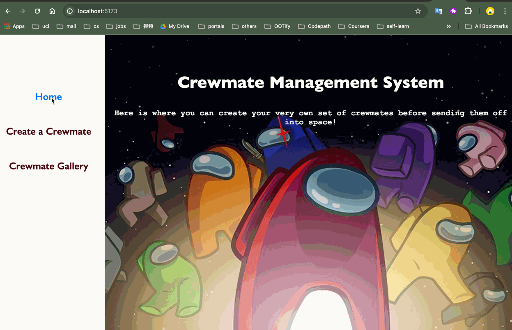

# Web Development Project 7 - *CRUD_Operations*

Submitted by: Emily Gao Wang
Total time spent: 6 hours

## Overview

This web app allows users to create, manage, and view a list of crewmates with customizable attributes.

## Features

**Core Functionality**

- Users can create new crewmates with customizable names and attributes.
- A summary page displays all created crewmates.
- Each crewmate can be updated or deleted from the list.
- Every crewmate has a unique link to their own info page.

**Optional Features**

- Summary statistics about the user's crew are displayed on the crew page.

## Video Walkthrough

Here's a walkthrough of implemented user stories:

<!-- Replace this with whatever GIF tool you used! -->
GIF created with LICECap.  
<!-- Recommended tools:
[Kap](https://getkap.co/) for macOS
[ScreenToGif](https://www.screentogif.com/) for Windows
[peek](https://github.com/phw/peek) for Linux. -->

## License

This project is licensed under the Apache License, Version 2.0. You may obtain a copy of the License at http://www.apache.org/licenses/LICENSE-2.0.
